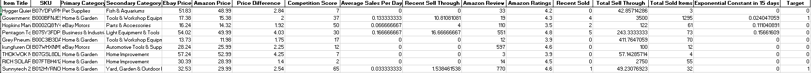

# Stacking-Ensemble-Machine-Learning
ML script designed to help classifying the selling performance from Amazon drop shipped listings on eBay 

# Inspiration
Over the years the numbers of Amazon drop shipped items being listed on eBay has rapidly grew and due to the introduction of Aliexpress drop shipped items, more and more Amazon based listings has been declining in performance. Therefore, we need to find a way to be selective for the listings we put up on eBay as a drop shipper to maximize return on every listings

# How we built it 
The program first utilize Multinomial Naive Bayes algorithm to analyze the correlation between keywords in Item Titles and its selling performance. We then take this result, store it as a column of data and ran Linear Support Vector Machine algorithm to look for the features with the most significance

# Import File
The imported file (Final_Results_wo30) is a dataset that contains both Amazon-based features and eBay-based features for more than 8000 listings. The features inside the dataset include Item Title, Amazon SKUs, eBay SKUs, Categories on eBay, eBay Prices, Amazon Prices, Number of same listings on eBay, Average Sales Per day on eBay, Sell Through rate and Number of Solds with and within the past 30 days and exponential constant that was measured based on the selling performance in past 15 days. These informations were previously being discovered from web scraping and eBaySDK calls 

